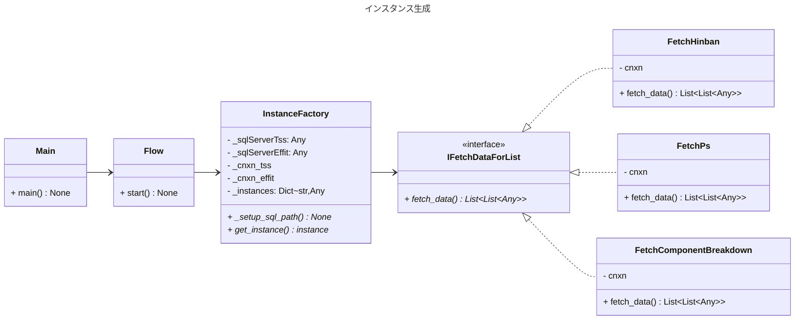
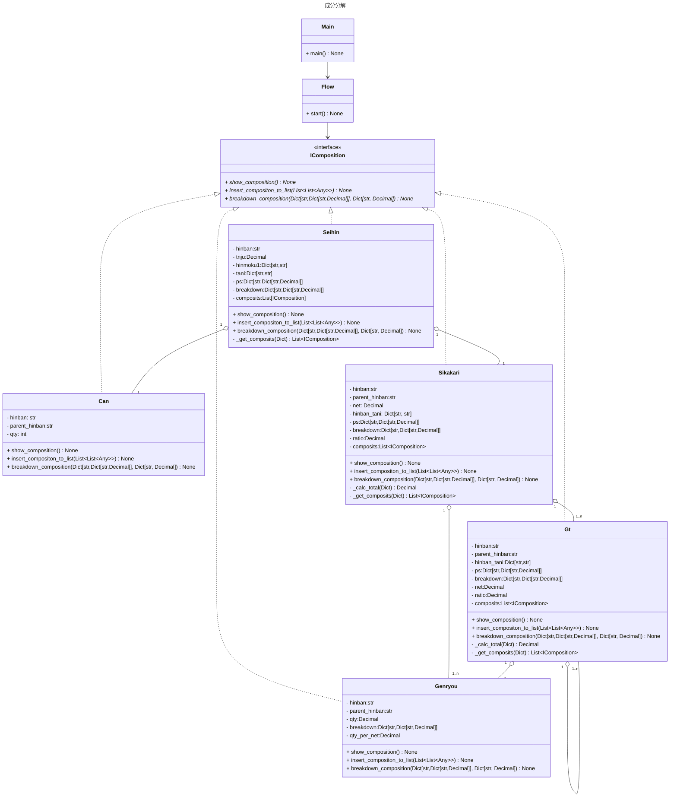
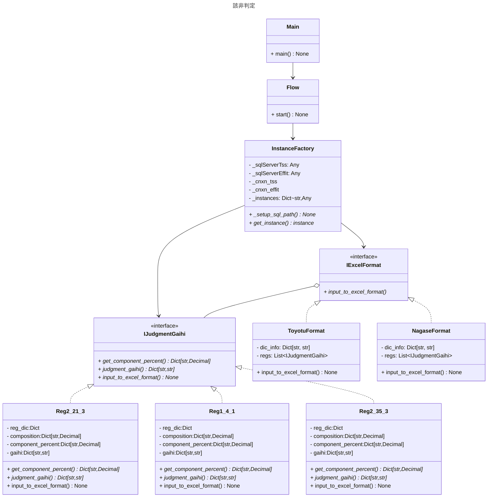

# 該非判定書自動作成アプリ
## システム概要
### 動作環境
- OS  
    - Windows11(pushd \\wsl$\Ubuntu\home\oga\projects\gaihi_hantei\main.py)
    - Linux(WSL)は不可（Tkinterを使っているため）
- インストール先
    - 和泉PC, 徳武PC
    - 尾頭PC(toyo-pc12) WSL2(Ubuntu)で開発
### 構築システム
- メインシステム: Python3.10
- Windowsスクリプト(gaihi.bat)
### ソースコード
GitHub Publicリポジトリで公開 
[GitHub_ https://github.com/ogashira/gaihi_hantei](https://github.com/ogashira/gaihi_hantei)
### 起動方法
##### soukoidou
- `Winボタン+R -> gaihi入力 -> Enter`または`pushd \\wsl$\Ubuntu\home\oga\projects\gaihi_hantei\`デイレクトリ内にて`python main.py`で実行
### 動作
#### GUI表示 「該非判定書自動作成」画面
- 品番、作成日を入力
- フォーマット選択（豊通 or 長瀬）
- フォーマットに応じて宛名が表示される。
- 「変更あり」ラジオボタンで宛先を修正できる
- 「該非判定書を作成する」をクリックでプログラムスタート
#### 配合計算
1. 製品 -> 缶 -> 仕掛かり品 -> GT品 -> 原料　に全て分解する
1. 原料分解表から、原料を更に分解する
#### 該非判定
##### Reg2_21_3
1. component_percent = {'トルエン': 25(%), 'エチルメチルケトン':10(%)} を求める
1. gaihi = {'reg2_21_3': '非'} を求める
##### Reg1_4_1
1. component_percent = {'末端に水酸基を有するポリブタジエン': 25(%)} を求める
1. gaihi = {'reg1_4_1': '非'} を求める
##### Reg2_35_3
1. component_percent = {'トリブチルスズ化合物': 25(%)} を求める
1. gaihi = {'reg2_35_3': '非'} を求める
### クラス図

